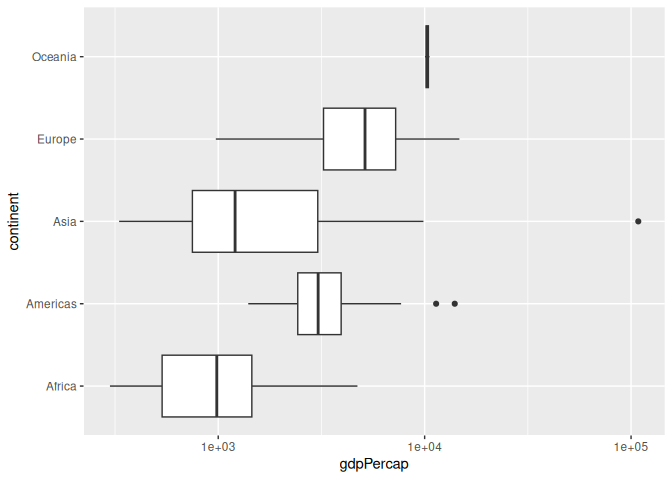
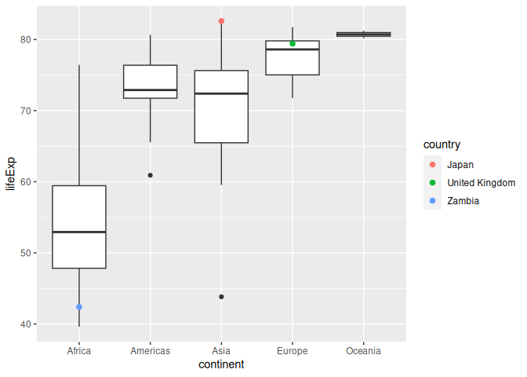
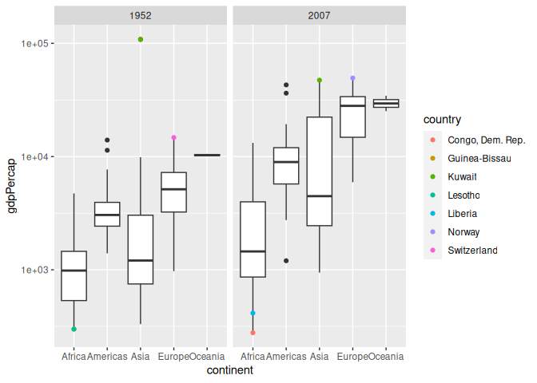
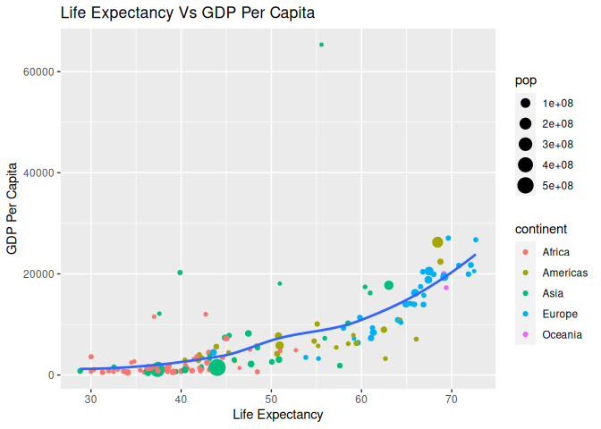
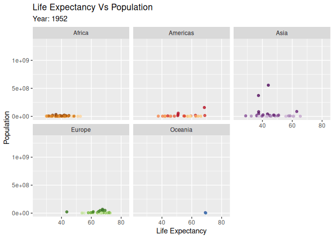
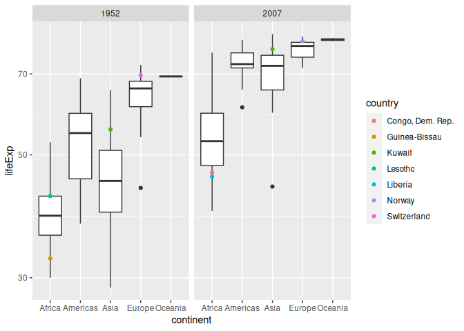

Gapminder
================
Reuben
2023-02-21

- [Grading Rubric](#grading-rubric)
  - [Individual](#individual)
  - [Due Date](#due-date)
- [Guided EDA](#guided-eda)
  - [**q0** Perform your “first checks” on the dataset. What variables
    are in this
    dataset?](#q0-perform-your-first-checks-on-the-dataset-what-variables-are-in-this-dataset)
  - [**q1** Determine the most and least recent years in the `gapminder`
    dataset.](#q1-determine-the-most-and-least-recent-years-in-the-gapminder-dataset)
  - [**q2** Filter on years matching `year_min`, and make a plot of the
    GDP per capita against continent. Choose an appropriate `geom_` to
    visualize the data. What observations can you
    make?](#q2-filter-on-years-matching-year_min-and-make-a-plot-of-the-gdp-per-capita-against-continent-choose-an-appropriate-geom_-to-visualize-the-data-what-observations-can-you-make)
  - [**q3** You should have found *at least* three outliers in q2 (but
    possibly many more!). Identify those outliers (figure out which
    countries they
    are).](#q3-you-should-have-found-at-least-three-outliers-in-q2-but-possibly-many-more-identify-those-outliers-figure-out-which-countries-they-are)
  - [**q4** Create a plot similar to yours from q2 studying both
    `year_min` and `year_max`. Find a way to highlight the outliers from
    q3 on your plot *in a way that lets you identify which country is
    which*. Compare the patterns between `year_min` and
    `year_max`.](#q4-create-a-plot-similar-to-yours-from-q2-studying-both-year_min-and-year_max-find-a-way-to-highlight-the-outliers-from-q3-on-your-plot-in-a-way-that-lets-you-identify-which-country-is-which-compare-the-patterns-between-year_min-and-year_max)
- [Your Own EDA](#your-own-eda)
  - [**q5** Create *at least* three new figures below. With each figure,
    try to pose new questions about the
    data.](#q5-create-at-least-three-new-figures-below-with-each-figure-try-to-pose-new-questions-about-the-data)

*Purpose*: Learning to do EDA well takes practice! In this challenge
you’ll further practice EDA by first completing a guided exploration,
then by conducting your own investigation. This challenge will also give
you a chance to use the wide variety of visual tools we’ve been
learning.

<!-- include-rubric -->

# Grading Rubric

<!-- -------------------------------------------------- -->

Unlike exercises, **challenges will be graded**. The following rubrics
define how you will be graded, both on an individual and team basis.

## Individual

<!-- ------------------------- -->

| Category    | Needs Improvement                                                                                                | Satisfactory                                                                                                               |
|-------------|------------------------------------------------------------------------------------------------------------------|----------------------------------------------------------------------------------------------------------------------------|
| Effort      | Some task **q**’s left unattempted                                                                               | All task **q**’s attempted                                                                                                 |
| Observed    | Did not document observations, or observations incorrect                                                         | Documented correct observations based on analysis                                                                          |
| Supported   | Some observations not clearly supported by analysis                                                              | All observations clearly supported by analysis (table, graph, etc.)                                                        |
| Assessed    | Observations include claims not supported by the data, or reflect a level of certainty not warranted by the data | Observations are appropriately qualified by the quality & relevance of the data and (in)conclusiveness of the support      |
| Specified   | Uses the phrase “more data are necessary” without clarification                                                  | Any statement that “more data are necessary” specifies which *specific* data are needed to answer what *specific* question |
| Code Styled | Violations of the [style guide](https://style.tidyverse.org/) hinder readability                                 | Code sufficiently close to the [style guide](https://style.tidyverse.org/)                                                 |

## Due Date

<!-- ------------------------- -->

All the deliverables stated in the rubrics above are due **at midnight**
before the day of the class discussion of the challenge. See the
[Syllabus](https://docs.google.com/document/d/1qeP6DUS8Djq_A0HMllMqsSqX3a9dbcx1/edit?usp=sharing&ouid=110386251748498665069&rtpof=true&sd=true)
for more information.

``` r
library(tidyverse)
```

    ## ── Attaching packages ─────────────────────────────────────── tidyverse 1.3.2 ──
    ## ✔ ggplot2 3.4.0     ✔ purrr   1.0.1
    ## ✔ tibble  3.1.8     ✔ dplyr   1.1.0
    ## ✔ tidyr   1.3.0     ✔ stringr 1.5.0
    ## ✔ readr   2.1.3     ✔ forcats 1.0.0
    ## ── Conflicts ────────────────────────────────────────── tidyverse_conflicts() ──
    ## ✖ dplyr::filter() masks stats::filter()
    ## ✖ dplyr::lag()    masks stats::lag()

``` r
library(gapminder)
```

*Background*: [Gapminder](https://www.gapminder.org/about-gapminder/) is
an independent organization that seeks to educate people about the state
of the world. They seek to counteract the worldview constructed by a
hype-driven media cycle, and promote a “fact-based worldview” by
focusing on data. The dataset we’ll study in this challenge is from
Gapminder.

# Guided EDA

<!-- -------------------------------------------------- -->

First, we’ll go through a round of *guided EDA*. Try to pay attention to
the high-level process we’re going through—after this guided round
you’ll be responsible for doing another cycle of EDA on your own!

### **q0** Perform your “first checks” on the dataset. What variables are in this dataset?

``` r
## TASK: Do your "first checks" here!
df_g = gapminder
head(df_g)
```

    ## # A tibble: 6 × 6
    ##   country     continent  year lifeExp      pop gdpPercap
    ##   <fct>       <fct>     <int>   <dbl>    <int>     <dbl>
    ## 1 Afghanistan Asia       1952    28.8  8425333      779.
    ## 2 Afghanistan Asia       1957    30.3  9240934      821.
    ## 3 Afghanistan Asia       1962    32.0 10267083      853.
    ## 4 Afghanistan Asia       1967    34.0 11537966      836.
    ## 5 Afghanistan Asia       1972    36.1 13079460      740.
    ## 6 Afghanistan Asia       1977    38.4 14880372      786.

**Observations**:

- The variables are:
  - country

  - continent

  - year

  - lifeExp

  - pop

  - gdpPercap

### **q1** Determine the most and least recent years in the `gapminder` dataset.

*Hint*: Use the `pull()` function to get a vector out of a tibble.
(Rather than the `$` notation of base R.)

``` r
## TASK: Find the largest and smallest values of `year` in `gapminder`
year_max <- 
  df_g %>% 
    summarize(max(year))
year_min <- 
  df_g %>% 
    summarize(min(year))
year_max = as.integer(year_max)
year_min = as.integer(year_min)
# Last time you got mad because I used the dollar sign so I did it both ways.
#year_max <- max(gapminder$year)
#year_min <- min(gapminder$year)
```

Use the following test to check your work.

``` r
## NOTE: No need to change this
assertthat::assert_that(year_max %% 7 == 5)
```

    ## [1] TRUE

``` r
assertthat::assert_that(year_max %% 3 == 0)
```

    ## [1] TRUE

``` r
assertthat::assert_that(year_min %% 7 == 6)
```

    ## [1] TRUE

``` r
assertthat::assert_that(year_min %% 3 == 2)
```

    ## [1] TRUE

``` r
if (is_tibble(year_max)) {
  print("year_max is a tibble; try using `pull()` to get a vector")
  assertthat::assert_that(False)
}

print("Nice!")
```

    ## [1] "Nice!"

### **q2** Filter on years matching `year_min`, and make a plot of the GDP per capita against continent. Choose an appropriate `geom_` to visualize the data. What observations can you make?

You may encounter difficulties in visualizing these data; if so document
your challenges and attempt to produce the most informative visual you
can.

``` r
## TASK: Create a visual of gdpPercap vs continent
df_g %>% 
  filter(year == min(year)) %>%
  ggplot(aes(gdpPercap, continent)) +
  geom_boxplot() +
  scale_x_log10()
```

<!-- -->

**Observations**:

- Oceania has a small range because there are so few countries
- There is a big outlier in Asia, Kuwait.
- Africa has the lowest average gdpPercap
- Maybe less of an observation and just a thought but this plot makes me
  think about just how different gdpPercap and median gdp must be.

**Difficulties & Approaches**:

- The main challenge was that the outliers made the graph hard to see.
  To fix this problem I took a log scale on the y axis.

### **q3** You should have found *at least* three outliers in q2 (but possibly many more!). Identify those outliers (figure out which countries they are).

``` r
## TASK: Identify the outliers from q2
#Take an average of all the years
df_g_countries <-
  df_g %>% 
    group_by(country) %>%
    mutate(gdpPercap = mean(gdpPercap)) %>%
    filter(!duplicated(country))
#First method is to just take the values from the plot
df_g_countries$country[which(df_g_countries$gdpPercap %in% boxplot(df_g_countries$gdpPercap,plot=FALSE)$out)]
```

    ## [1] Kuwait        Norway        Switzerland   United States
    ## 142 Levels: Afghanistan Albania Algeria Angola Argentina Australia ... Zimbabwe

``` r
#Second method is to do all the calculations out and get the values that are 2 standard devations away from the mean
gdpPercap_c = df_g_countries$gdpPercap
mean = mean(gdpPercap_c)
std = sd(gdpPercap_c)
Tmin = mean-(2*std)
Tmax = mean+(2*std)
gdpPercap_outliers <- 
  df_g_countries %>% 
  filter(!between(gdpPercap, Tmin, Tmax))
gdpPercap_outliers
```

    ## # A tibble: 4 × 6
    ## # Groups:   country [4]
    ##   country       continent  year lifeExp       pop gdpPercap
    ##   <fct>         <fct>     <int>   <dbl>     <int>     <dbl>
    ## 1 Kuwait        Asia       1952    55.6    160000    65333.
    ## 2 Norway        Europe     1952    72.7   3327728    26747.
    ## 3 Switzerland   Europe     1952    69.6   4815000    27074.
    ## 4 United States Americas   1952    68.4 157553000    26261.

**Observations**:

- Identify the outlier countries from q2
  - Kuwait
  - Norway
  - Switzerland
  - United States

*Hint*: For the next task, it’s helpful to know a ggplot trick we’ll
learn in an upcoming exercise: You can use the `data` argument inside
any `geom_*` to modify the data that will be plotted *by that geom
only*. For instance, you can use this trick to filter a set of points to
label:

``` r
## NOTE: No need to edit, use ideas from this in q4 below
gapminder %>%
  filter(year == max(year)) %>%

  ggplot(aes(continent, lifeExp)) +
  geom_boxplot() +
  geom_point(
    data = . %>% filter(country %in% c("United Kingdom", "Japan", "Zambia")),
    mapping = aes(color = country),
    size = 2
  )
```

<!-- -->

### **q4** Create a plot similar to yours from q2 studying both `year_min` and `year_max`. Find a way to highlight the outliers from q3 on your plot *in a way that lets you identify which country is which*. Compare the patterns between `year_min` and `year_max`.

*Hint*: We’ve learned a lot of different ways to show multiple
variables; think about using different aesthetics or facets.

``` r
## TASK: Create a visual of gdpPercap vs continent
gapminder %>%
  filter(year == max(year) | year == min(year)) %>%
  ggplot(aes(continent, gdpPercap)) +
  geom_boxplot() +
  geom_point(
    data = . %>% 
      group_by(year) %>%
      filter(
          gdpPercap < quantile(gdpPercap, 0.01) | 
          gdpPercap > quantile(gdpPercap, 0.99)
      ),
    mapping = aes(color = country)
  ) +
  scale_y_log10() +
  facet_wrap(~year)
```

<!-- -->

**Observations**:

- Kuwait was a big outlier and they are now less of one.
- Other than Kuwait, the outliers have changed quite a bit.

# Your Own EDA

<!-- -------------------------------------------------- -->

Now it’s your turn! We just went through guided EDA considering the GDP
per capita at two time points. You can continue looking at outliers,
consider different years, repeat the exercise with `lifeExp`, consider
the relationship between variables, or something else entirely.

### **q5** Create *at least* three new figures below. With each figure, try to pose new questions about the data.

``` r
## TASK: Your first graph
df_g_countries %>%
  ggplot(aes(lifeExp, gdpPercap)) +
  geom_point(aes(col=continent, size=pop)) +
  geom_smooth(method="loess", se=F) +
  labs(title="Life Expectancy Vs GDP Per Capita", y="GDP Per Capita", x="Life Expectancy")
```

    ## `geom_smooth()` using formula = 'y ~ x'

<!-- -->

- Life expectancy and GDP per capita are correlated
- European countries tend to have higher GDP per capitas then African
  countries.
- It seems like higher life expediencies don’t necessarily mean larger
  populations. Having information on birth rate might help us with
  figuring out what is going on with that.

``` r
## TASK: Your second graph
library(gganimate)
life_v_pop_plot <- 
  gapminder %>%
    ggplot(aes(lifeExp, pop, color = country)) +
    geom_point(alpha = 0.75, show.legend = FALSE) +
    scale_colour_manual(values = country_colors) +
    facet_wrap(~continent) +
    labs(title="Life Expectancy Vs Population", subtitle = "Year: {frame_time}", y="Population", x="Life Expectancy") +
    transition_time(year) +
    ease_aes("linear")
animate(life_v_pop_plot, duration = 12.5, fps = 20)
```

<!-- -->

- As time increases, both population and life expectancy tend to
  increase.
- There is one interesting country in Africa that has its life
  expectancy drop a ton in 1991.
- In Africa in particular, the life expectancy tends to spread out
  instead of all of the countries increasing equally.
- Two countries in Asia are big outliers in terms of population growth.

``` r
## TASK: Your third graph
gapminder %>%
  filter(year == max(year) | year == min(year)) %>%
  ggplot(aes(continent, lifeExp)) +
  geom_boxplot() +
  geom_point(
    data = . %>% 
      group_by(year) %>%
      filter(
          gdpPercap < quantile(gdpPercap, 0.01) | 
          gdpPercap > quantile(gdpPercap, 0.99)
      ),
    mapping = aes(color = country)
  ) +
  scale_y_log10() +
  facet_wrap(~year)
```

<!-- -->

- The outliers in terms of life expectancy are disproportionately in
  Africa.
- The range of life expectancy has shrunk slightly over time.
