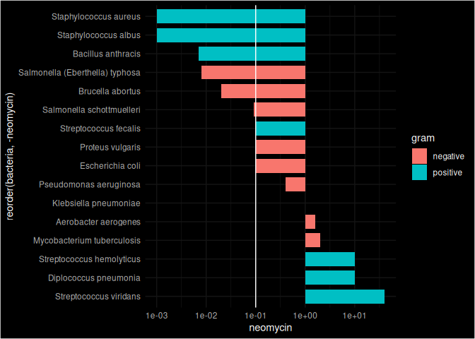

Antibiotics
================
Reuben Lewis
2022-02-27

*Purpose*: Creating effective data visualizations is an *iterative*
process; very rarely will the first graph you make be the most
effective. The most effective thing you can do to be successful in this
iterative process is to *try multiple graphs* of the same data.

Furthermore, judging the effectiveness of a visual is completely
dependent on *the question you are trying to answer*. A visual that is
totally ineffective for one question may be perfect for answering a
different question.

In this challenge, you will practice *iterating* on data visualization,
and will anchor the *assessment* of your visuals using two different
questions.

*Note*: Please complete your initial visual design **alone**. Work on
both of your graphs alone, and save a version to your repo *before*
coming together with your team. This way you can all bring a diversity
of ideas to the table!

<!-- include-rubric -->

# Grading Rubric

<!-- -------------------------------------------------- -->

Unlike exercises, **challenges will be graded**. The following rubrics
define how you will be graded, both on an individual and team basis.

## Individual

<!-- ------------------------- -->

| Category    | Needs Improvement                                                                                                | Satisfactory                                                                                                               |
|-------------|------------------------------------------------------------------------------------------------------------------|----------------------------------------------------------------------------------------------------------------------------|
| Effort      | Some task **q**’s left unattempted                                                                               | All task **q**’s attempted                                                                                                 |
| Observed    | Did not document observations, or observations incorrect                                                         | Documented correct observations based on analysis                                                                          |
| Supported   | Some observations not clearly supported by analysis                                                              | All observations clearly supported by analysis (table, graph, etc.)                                                        |
| Assessed    | Observations include claims not supported by the data, or reflect a level of certainty not warranted by the data | Observations are appropriately qualified by the quality & relevance of the data and (in)conclusiveness of the support      |
| Specified   | Uses the phrase “more data are necessary” without clarification                                                  | Any statement that “more data are necessary” specifies which *specific* data are needed to answer what *specific* question |
| Code Styled | Violations of the [style guide](https://style.tidyverse.org/) hinder readability                                 | Code sufficiently close to the [style guide](https://style.tidyverse.org/)                                                 |

## Submission

<!-- ------------------------- -->

Make sure to commit both the challenge report (`report.md` file) and
supporting files (`report_files/` folder) when you are done! Then submit
a link to Canvas. **Your Challenge submission is not complete without
all files uploaded to GitHub.**

``` r
library(tidyverse)
```

    ## ── Attaching packages ─────────────────────────────────────── tidyverse 1.3.2 ──
    ## ✔ ggplot2 3.4.0     ✔ purrr   1.0.1
    ## ✔ tibble  3.1.8     ✔ dplyr   1.1.0
    ## ✔ tidyr   1.3.0     ✔ stringr 1.5.0
    ## ✔ readr   2.1.3     ✔ forcats 1.0.0
    ## ── Conflicts ────────────────────────────────────────── tidyverse_conflicts() ──
    ## ✖ dplyr::filter() masks stats::filter()
    ## ✖ dplyr::lag()    masks stats::lag()

``` r
library(ggrepel)
library(ggdark)
```

*Background*: The data\[1\] we study in this challenge report the
[*minimum inhibitory
concentration*](https://en.wikipedia.org/wiki/Minimum_inhibitory_concentration)
(MIC) of three drugs for different bacteria. The smaller the MIC for a
given drug and bacteria pair, the more practical the drug is for
treating that particular bacteria. An MIC value of *at most* 0.1 is
considered necessary for treating human patients.

These data report MIC values for three antibiotics—penicillin,
streptomycin, and neomycin—on 16 bacteria. Bacteria are categorized into
a genus based on a number of features, including their resistance to
antibiotics.

``` r
## NOTE: If you extracted all challenges to the same location,
## you shouldn't have to change this filename
filename <- "./data/antibiotics.csv"

## Load the data
df_antibiotics <- read_csv(filename)
```

    ## Rows: 16 Columns: 5
    ## ── Column specification ────────────────────────────────────────────────────────
    ## Delimiter: ","
    ## chr (2): bacteria, gram
    ## dbl (3): penicillin, streptomycin, neomycin
    ## 
    ## ℹ Use `spec()` to retrieve the full column specification for this data.
    ## ℹ Specify the column types or set `show_col_types = FALSE` to quiet this message.

``` r
df_antibiotics %>% knitr::kable()
```

| bacteria                        | penicillin | streptomycin | neomycin | gram     |
|:--------------------------------|-----------:|-------------:|---------:|:---------|
| Aerobacter aerogenes            |    870.000 |         1.00 |    1.600 | negative |
| Brucella abortus                |      1.000 |         2.00 |    0.020 | negative |
| Bacillus anthracis              |      0.001 |         0.01 |    0.007 | positive |
| Diplococcus pneumonia           |      0.005 |        11.00 |   10.000 | positive |
| Escherichia coli                |    100.000 |         0.40 |    0.100 | negative |
| Klebsiella pneumoniae           |    850.000 |         1.20 |    1.000 | negative |
| Mycobacterium tuberculosis      |    800.000 |         5.00 |    2.000 | negative |
| Proteus vulgaris                |      3.000 |         0.10 |    0.100 | negative |
| Pseudomonas aeruginosa          |    850.000 |         2.00 |    0.400 | negative |
| Salmonella (Eberthella) typhosa |      1.000 |         0.40 |    0.008 | negative |
| Salmonella schottmuelleri       |     10.000 |         0.80 |    0.090 | negative |
| Staphylococcus albus            |      0.007 |         0.10 |    0.001 | positive |
| Staphylococcus aureus           |      0.030 |         0.03 |    0.001 | positive |
| Streptococcus fecalis           |      1.000 |         1.00 |    0.100 | positive |
| Streptococcus hemolyticus       |      0.001 |        14.00 |   10.000 | positive |
| Streptococcus viridans          |      0.005 |        10.00 |   40.000 | positive |

``` r
df_antibiotics
```

    ## # A tibble: 16 × 5
    ##    bacteria                        penicillin streptomycin neomycin gram    
    ##    <chr>                                <dbl>        <dbl>    <dbl> <chr>   
    ##  1 Aerobacter aerogenes               870             1       1.6   negative
    ##  2 Brucella abortus                     1             2       0.02  negative
    ##  3 Bacillus anthracis                   0.001         0.01    0.007 positive
    ##  4 Diplococcus pneumonia                0.005        11      10     positive
    ##  5 Escherichia coli                   100             0.4     0.1   negative
    ##  6 Klebsiella pneumoniae              850             1.2     1     negative
    ##  7 Mycobacterium tuberculosis         800             5       2     negative
    ##  8 Proteus vulgaris                     3             0.1     0.1   negative
    ##  9 Pseudomonas aeruginosa             850             2       0.4   negative
    ## 10 Salmonella (Eberthella) typhosa      1             0.4     0.008 negative
    ## 11 Salmonella schottmuelleri           10             0.8     0.09  negative
    ## 12 Staphylococcus albus                 0.007         0.1     0.001 positive
    ## 13 Staphylococcus aureus                0.03          0.03    0.001 positive
    ## 14 Streptococcus fecalis                1             1       0.1   positive
    ## 15 Streptococcus hemolyticus            0.001        14      10     positive
    ## 16 Streptococcus viridans               0.005        10      40     positive

# Visualization

<!-- -------------------------------------------------- -->

### **q1** Prototype 5 visuals

To start, construct **5 qualitatively different visualizations of the
data** `df_antibiotics`. These **cannot** be simple variations on the
same graph; for instance, if two of your visuals could be made identical
by calling `coord_flip()`, then these are *not* qualitatively different.

For all five of the visuals, you must show information on *all 16
bacteria*. For the first two visuals, you must *show all variables*.

*Hint 1*: Try working quickly on this part; come up with a bunch of
ideas, and don’t fixate on any one idea for too long. You will have a
chance to refine later in this challenge.

*Hint 2*: The data `df_antibiotics` are in a *wide* format; it may be
helpful to `pivot_longer()` the data to make certain visuals easier to
construct.

#### Visual 1 (All variables)

In this visual you must show *all three* effectiveness values for *all
16 bacteria*. This means **it must be possible to identify each of the
16 bacteria by name.** You must also show whether or not each bacterium
is Gram positive or negative.

``` r
# WRITE YOUR CODE HERE
library(ggrepel)

df_antibiotics %>% 
  ggplot(aes(penicillin, streptomycin, color = neomycin)) +
  scale_colour_gradient(trans="log10") +
  geom_point(aes(shape = gram), alpha = 0.75, size = 3) +
  scale_y_log10() +
  geom_label_repel(aes(label = bacteria, fill = neomycin), color = "black", size = 2.75, box.padding = 0.25, point.padding = 1, segment.color = 'grey50') +
  scale_fill_gradient(trans="log10") +
  dark_theme_minimal()
```

    ## Inverted geom defaults of fill and color/colour.
    ## To change them back, use invert_geom_defaults().

<!-- -->

#### Visual 2 (All variables)

In this visual you must show *all three* effectiveness values for *all
16 bacteria*. This means **it must be possible to identify each of the
16 bacteria by name.** You must also show whether or not each bacterium
is Gram positive or negative.

Note that your visual must be *qualitatively different* from *all* of
your other visuals.

``` r
# WRITE YOUR CODE HERE
df_antibiotics_l <- 
  df_antibiotics %>% 
  pivot_longer(
    names_to = "name",
    values_to = "mic",
    cols = penicillin:neomycin
  )
df_antibiotics_l %>% 
  ggplot(aes(x = bacteria, color = name)) +
  geom_point(aes(y = mic, shape = gram), alpha = 0.85, size = 2.5) +
  scale_y_log10() +
  coord_flip() +
  dark_theme_minimal()
```

<!-- -->

#### Visual 3 (Some variables)

In this visual you may show a *subset* of the variables (`penicillin`,
`streptomycin`, `neomycin`, `gram`), but you must still show *all 16
bacteria*.

Note that your visual must be *qualitatively different* from *all* of
your other visuals.

``` r
# WRITE YOUR CODE HERE
df_antibiotics %>% 
  ggplot(aes(x = reorder(bacteria, -neomycin), y = neomycin)) +
  geom_bar(aes(fill = gram), stat = "identity", width = .75) +
  geom_hline(yintercept = 0.1) +
  scale_y_log10() +
  coord_flip() +
  dark_theme_minimal()
```

<!-- -->

#### Visual 4 (Some variables)

In this visual you may show a *subset* of the variables (`penicillin`,
`streptomycin`, `neomycin`, `gram`), but you must still show *all 16
bacteria*.

Note that your visual must be *qualitatively different* from *all* of
your other visuals.

``` r
# WRITE YOUR CODE HERE
df_antibiotics_l %>% 
  mutate(q2_category = ifelse((grepl("Streptococcus|Diplococcus", bacteria)), TRUE, FALSE)) %>% 
  ggplot(aes(x = bacteria, y = mic)) +
  geom_bar(aes(fill = gram, linetype = q2_category), stat = "identity", width = .75, size = 0.6, color = "magenta") +
  dark_theme_minimal() +
  theme(axis.text.x = element_text(angle=0, vjust=0.65)) +
  theme(axis.text.y = element_text(size = 4.5)) +
  geom_hline(yintercept = 0.1) +
  coord_flip() +
  facet_wrap(~name, ncol = 1) +
  scale_y_log10()
```

    ## Warning: Using `size` aesthetic for lines was deprecated in ggplot2 3.4.0.
    ## ℹ Please use `linewidth` instead.

<!-- -->

#### Visual 5 (Some variables)

In this visual you may show a *subset* of the variables (`penicillin`,
`streptomycin`, `neomycin`, `gram`), but you must still show *all 16
bacteria*.

Note that your visual must be *qualitatively different* from *all* of
your other visuals.

``` r
# WRITE YOUR CODE HERE
df_antibiotics_l <- df_antibiotics_l %>% 
  mutate(effective = case_when(mic <= 0.1 ~ TRUE, mic > 0.1 ~ FALSE))
  
df_antibiotics_l %>% 
  ggplot(aes(name, bacteria, fill = mic)) +
  scale_fill_gradient(trans="log10") +
  geom_tile() +
  geom_tile(data = df_antibiotics_l, aes(colour = factor(effective, c(TRUE, FALSE)), size = factor(effective, c(TRUE, FALSE))), alpha = 0) + 
  scale_colour_manual("effective", values = c("orange2", "white")) + 
  scale_size_manual("effective", values = c(.5, 0)) +
  dark_theme_minimal()
```

<!-- -->

### **q2** Assess your visuals

There are **two questions** below; use your five visuals to help answer
both Guiding Questions. Note that you must also identify which of your
five visuals were most helpful in answering the questions.

*Hint 1*: It’s possible that *none* of your visuals is effective in
answering the questions below. You may need to revise one or more of
your visuals to answer the questions below!

*Hint 2*: It’s **highly unlikely** that the same visual is the most
effective at helping answer both guiding questions. **Use this as an
opportunity to think about why this is.**

#### Guiding Question 1

> How do the three antibiotics vary in their effectiveness against
> bacteria of different genera and Gram stain?

*Observations* - What is your response to the question above? - Neomycin
is effective on the highest number of types, followed by penicillin and
then streptomycin.- Which of your visuals above (1 through 5) is **most
effective** at helping to answer this question? - Plot 5 works the best
here. - Why? - Each pair is highlighted when the antibiotic is
effective, which means its super easy to see. All of the bacteria are
along the y axis and the mic values are along the x axis. You can scan
horizontally very quickly to see which antibiotics are effective on a
certain bacteria, and you can scan vertically to see which bacteria the
antibiotics are effective on. In terms of gram strain, penicillin and
streptomycin are only effective on gram positive bacteria. Neomycin,
however, can be effective on some gram negative bacteria. This is best
shown in visual 4. This visual compares each of the three antibiotics in
different facets all above each other. It includes a helpful line at 0.1
to see if the antibiotic is effective or not.

#### Guiding Question 2

In 1974 *Diplococcus pneumoniae* was renamed *Streptococcus pneumoniae*,
and in 1984 *Streptococcus fecalis* was renamed *Enterococcus fecalis*
\[2\].

> Why was *Diplococcus pneumoniae* was renamed *Streptococcus
> pneumoniae*?

*Observations* - What is your response to the question above? - All of
the Streptococcus bacteria are very similar in mic value to the bacteria
formerly known as *Diplococcus pneumoniae.* Additionally, they all have
the same gram value.- Which of your visuals above (1 through 5) is
**most effective** at helping to answer this question? - 4 - Why? - This
visual is a comparison of all of the Streptococcus bacteria and
*Diplococcus pneumoniae*. The plot is a subset of the data which helps
compare a specific set of values. All of the plots are places on top of
each other so it is easy to scan downwards to compare bar lengths.

# References

<!-- -------------------------------------------------- -->

\[1\] Neomycin in skin infections: A new topical antibiotic with wide
antibacterial range and rarely sensitizing. Scope. 1951;3(5):4-7.

\[2\] Wainer and Lysen, “That’s Funny…” *American Scientist* (2009)
[link](https://www.americanscientist.org/article/thats-funny)
